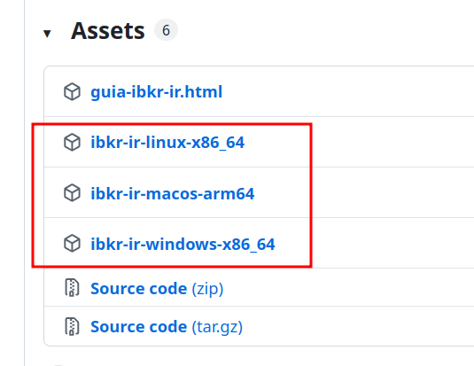

# IBKR para IRPF

Programa gratuito que lê o **Activity Statement** (extrato de atividades) da **Interactive Brokers** e gera um relatório HTML com os valores para a declaração do **IRPF** — Bens e Direitos, dividendos, ganho de capital e avisos sobre DARF, GCAP e CBE.

> Ferramenta não oficial. Não tem ligação com a Interactive Brokers. **Não é assessoria fiscal** — confira tudo com um contador antes de enviar a declaração.

---

## Privacidade

- Roda **100% no seu computador**
- **Não** envia seu extrato da IBKR para nenhum servidor
- Na primeira execução, busca taxas **PTAX** no site do Banco Central (e guarda em `cache/` no seu computador)
- **Não** compartilhe seu extrato CSV, a pasta `output/` nem o `cache/` publicamente

---

## O que faz

- Lê o extrato **Activity Statement** exportado da IBKR em **CSV**
- Calcula valores em reais (com PTAX) para copiar no IRPF
- Gera **`output/irpf-AAAA.html`** — abra no navegador e use os botões de copiar
- Salva **`output/irpf-AAAA.json`** para facilitar a declaração do ano seguinte

O relatório inclui, entre outros:

- **Bens e Direitos** (ações no exterior + saldo em dólar)
- **Rendimentos Isentos** (dividendos)
- **Ganho de capital** (método de custo médio em reais)
- Avisos informativos sobre **DARF**, **GCAP** e **CBE**

---

## Como usar (depois de baixar)

1. Exporte o **Activity Statement** da IBKR em **CSV** (não use o arquivo "Transactions") — passo a passo em [`docs/guia-ibkr-ir.html`](docs/guia-ibkr-ir.html) (também copiado para sua pasta na primeira execução)
2. Coloque o **programa** e o **extrato CSV** na **mesma pasta**
3. Abra o terminal **dentro dessa pasta** e rode (ajuste o ano e o nome do arquivo):

**Windows**

```text
ibkr-ir.exe --year 2025 --statement statement_2025.csv
```

**Mac / Linux**

```bash
chmod +x ibkr-ir-macos-arm64   # uma vez, após o download
./ibkr-ir-macos-arm64 --year 2025 --statement statement_2025.csv
```

4. Abra **`output/irpf-2025.html`** no navegador (Chrome, Firefox, Edge, Safari)
5. Copie os valores para o programa da Receita Federal

**Dica:** crie uma **pasta fixa** só para o IRPF (programa + extratos + relatórios). Exemplo:

```text
ibkr-ir/
├── ibkr-ir-macos-arm64      ← programa (ou ibkr-ir.exe no Windows)
├── statement_2025.csv       ← extrato da IBKR
├── output/
│   └── irpf-2025.html       ← seu guia (abra no navegador)
└── cache/
    └── ptax/                ← taxas PTAX (criado automaticamente)
```

---

## Como baixar o programa

1. Abra a página de **[Releases](https://github.com/joaovictornsv/ibkr-ir/releases)**
2. Baixe o arquivo do **seu sistema** — **não** baixe "Source code":
   - **Windows:** `ibkr-ir-windows-x86_64` (pode renomear para `ibkr-ir.exe`)
   - **Mac (Apple Silicon):** `ibkr-ir-macos-arm64`
   - **Linux:** `ibkr-ir-linux-x86_64`
3. Coloque numa **pasta fixa** (ex.: `Documentos/ibkr-ir/`)
4. **Leia o guia antes da primeira execução:** abra [`docs/guia-ibkr-ir.html`](docs/guia-ibkr-ir.html) no navegador



**Mac:** na primeira execução pode aparecer aviso de segurança. Use **Ajustes do Sistema → Privacidade e Segurança → Abrir assim mesmo**, ou rode `xattr -cr ./ibkr-ir-macos-arm64` uma vez.

**Internet:** necessária na **primeira execução** para buscar as taxas PTAX; depois ficam salvas em `cache/ptax`.

---

## Problemas comuns

| Problema | O que fazer |
| -------- | ----------- |
| Erro ao ler o CSV | Confira se exportou o **Activity Statement** (não "Transactions") em **CSV** (não PDF). Veja [`docs/guia-ibkr-ir.html`](docs/guia-ibkr-ir.html). |
| Arquivo não encontrado | Abra o terminal **dentro da pasta** onde estão o programa e o extrato. |
| Valores provisórios | Se exportou antes de 31/12, reexporte em janeiro com o ano completo (1º jan – 31 dez). |
| Mac bloqueia o programa | **Privacidade e Segurança → Abrir assim mesmo**, ou `xattr -cr ./ibkr-ir-macos-arm64`. |
| Sem internet na 1ª vez | O programa precisa baixar PTAX do BCB na primeira execução. |

Algo não funcionou? Abra uma [issue no GitHub](https://github.com/joaovictornsv/ibkr-ir/issues) ou escreva para [hi@joaovictornsv.dev](mailto:hi@joaovictornsv.dev).

---

## Para desenvolvedores

Detalhes técnicos, código-fonte, testes e publicação de versões: **[TECH_README.md](TECH_README.md)**
